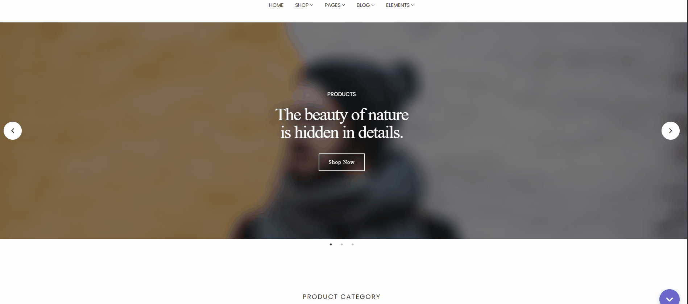
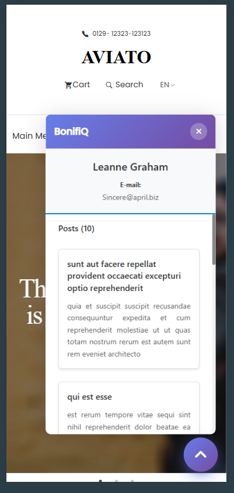
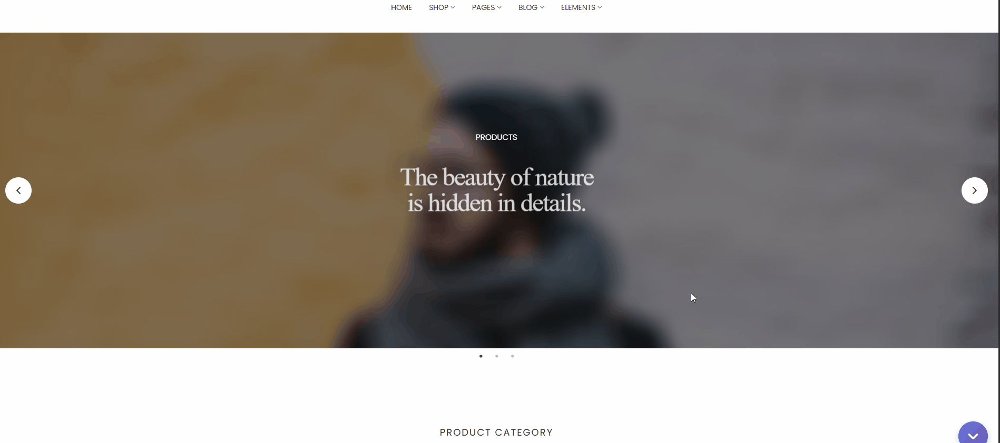

# BonifiQ — Widget front-end

Solução da prova prática: widget embutível em sites de terceiros que abre um iframe com uma aplicação **React (Vite + TypeScript)**. O iframe obtém o ID do usuário logado na página pai via **postMessage**, consulta a [JSONPlaceholder](https://jsonplaceholder.typicode.com/) e exibe dados do usuário e seus posts.

## Stack

- **React 19** + **TypeScript**
- **Vite 7**
- Script vanilla em `public/widget.js` (sem build) e estilos em `public/widget.css`
- Testes com **Vitest** e **Testing Library**

## Estrutura do repositório

| Caminho | Descrição |
|--------|-----------|
| `react-app/` | Aplicação Vite servida dentro do iframe |
| `public/widget.js` | Script de integração: botão flutuante, iframe, comunicação com a app |
| `public/widget.css` | Estilos do botão e do painel do widget |
| `sites-exemplo/` | Três páginas HTML estáticas que simulam sites reais (`window.loggedUserId` + carregamento do script) |
| `imgs/project/` | Capturas e GIFs de referência deste README |

## Pré-requisitos

- [Node.js](https://nodejs.org/) (recomendado: LTS atual)
- npm (vem com o Node)

## Como executar a aplicação React

Na pasta `react-app`:

```bash
cd react-app
npm install
npm run dev
```

Por padrão o Vite sobe em `http://localhost:5173`. Esse endereço é o mesmo usado pelo widget quando nenhuma URL customizada é definida.

### Build e preview

```bash
npm run build
npm run preview
```

## Como integrar o widget em um site

1. Defina na página o ID do usuário logado (número válido na API, por exemplo `1` a `10` na JSONPlaceholder):

   ```html
   <script>
     window.loggedUserId = 2;
   </script>
   ```

2. Inclua o CSS do widget (caminho relativo ao seu HTML) e o script:

   ```html
   <link rel="stylesheet" href="caminho/para/widget.css" />
   <script src="caminho/para/widget.js"></script>
   ```

3. Opcionalmente, antes do `widget.js`, você pode configurar:

   - `window.BONIFIQ_WIDGET_URL` — URL base onde a app React está hospedada (padrão: `http://localhost:5173`).
   - `window.BONIFIQ_WIDGET_CSS_PATH` — caminho absoluto ou relativo para `widget.css` (padrão relativo ao script: `../../public/widget.css`).

O botão fixo no canto inferior direito abre e fecha o painel; há também botão de fechar no cabeçalho do widget. O iframe fica oculto até a app enviar `WIDGET_READY`; se isso não ocorrer em 5 segundos, é exibida mensagem de erro no painel.

## Testar com os sites de exemplo

1. Suba a app: `cd react-app && npm run dev`.
2. Abra no navegador um dos arquivos `sites-exemplo/Site01/index.html`, `Site02/index.html` ou `Site03/index.html` (cada um define `window.loggedUserId` com valor diferente nos respectivos `js/script.js` ou `js/scripts.js`).
3. Use um servidor HTTP local se o navegador bloquear recursos em `file://` — por exemplo, na raiz do repositório:

   ```bash
   npx --yes serve .
   ```

   Depois acesse a URL do site de exemplo (ajuste a porta conforme o `serve` indicar).

## Testes unitários

Na pasta `react-app`, com dependências instaladas:

```bash
npx vitest run
```

## Comportamento resumido

- A página pai expõe `window.loggedUserId`.
- O iframe (React) envia `GET_USER_ID`; o `widget.js` na página pai responde com `USER_ID_RESPONSE` e o `userId`.
- A app busca `GET /users/:id` e `GET /posts?userId=:id`, mostra loading, erros com opção de tentar de novo e lista de posts (título e corpo).

## Referência visual

### Widget aberto (desktop)



### Widget em viewport mobile



### Falha ao carregar o conteúdo do iframe


